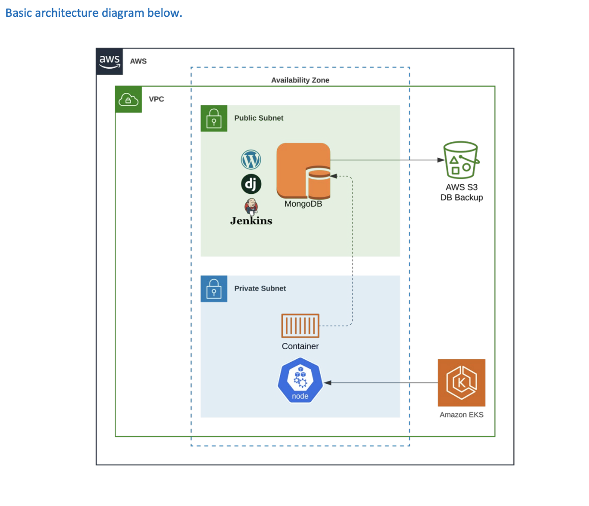
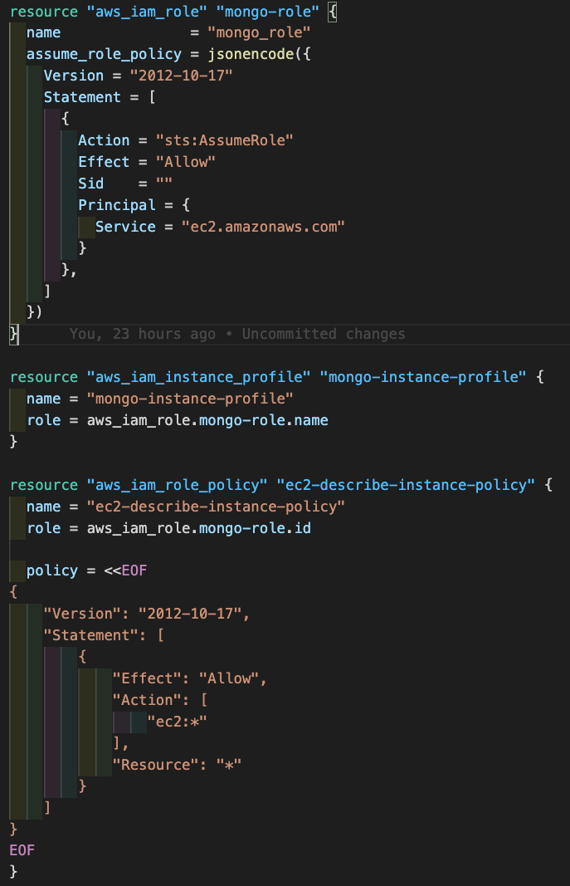
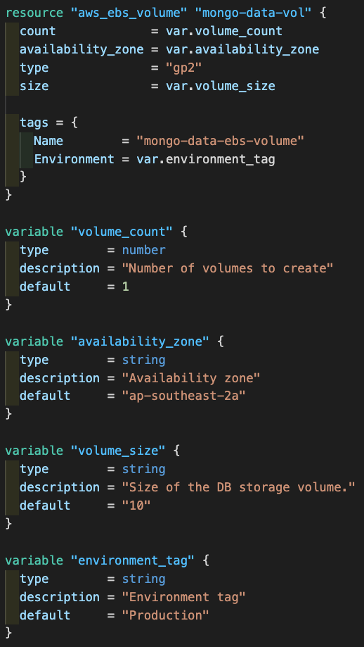
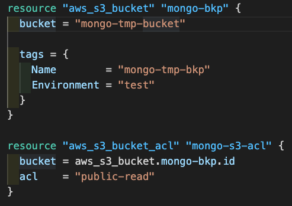
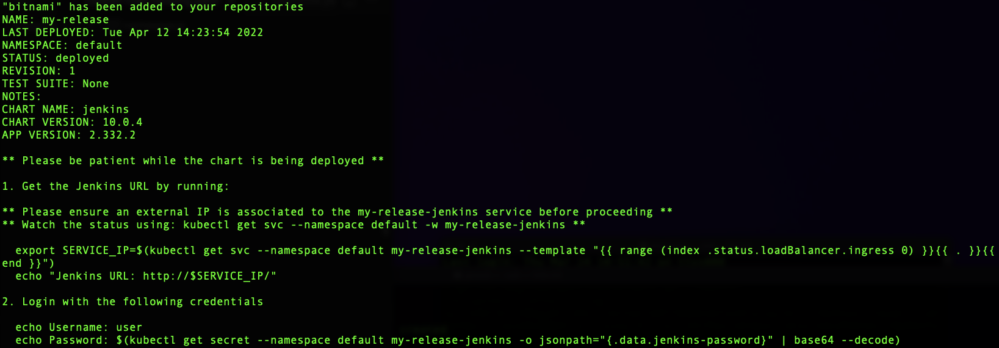
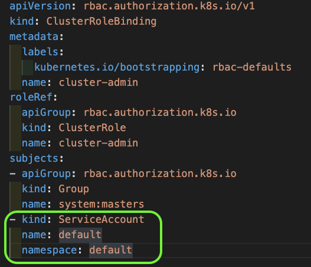
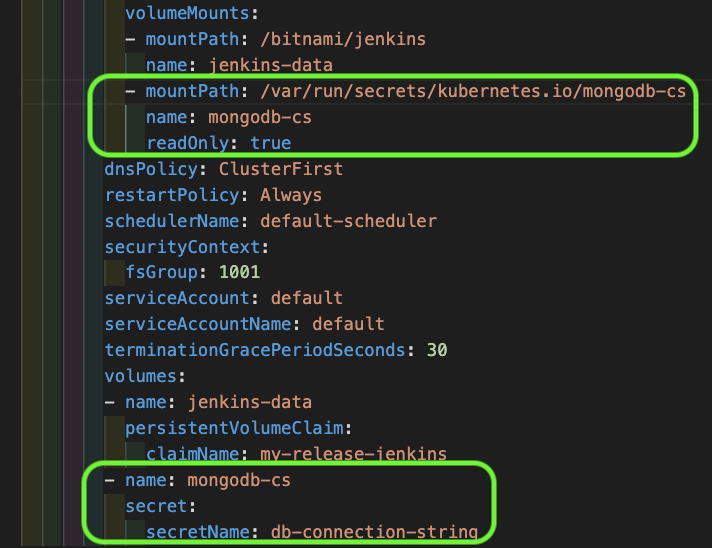

# Automating MongoDB in AWS


## Introduction

The objective of the exercise is to build a containerized web application running on an AWS EKS cluster and an instance that runs MongoDB, which can perform backups to an S3 storage bucket. The web application will be publicly facing for customer access. The MongoDB server will also be built in a way where it could potentially store data generated by the web application. The Mongo DB should be able to generate backups to an S3 storage bucket that is also publicly exposed.




## Automation

Hashicorp Terraform and Ansible have been used to automate the provisioning of the stack. Terraform is used to provision the AWS EKS cluster, S3 bucket and an AWS EC2 instance, `Ubuntu 18.04.6`, with the required IAM instance profile. Ansible is used to install `MongoDB 4.2.19` on the EC2 instance.


### AWS VPC

```
 cidr                 = "172.16.0.0/16"
 azs                  = data.aws_availability_zones.available.names
 private_subnets      = ["172.16.1.0/24", "172.16.2.0/24", "172.16.3.0/24"]
 public_subnets       = ["172.16.4.0/24", "172.16.5.0/24", "172.16.6.0/24"]
 enable_nat_gateway   = true
 single_nat_gateway   = true
 enable_dns_hostnames = true
```

### AWS EKS Cluster


* Kubernetes 1.21
* 3 x worker nodes m5.large ec2 instances in the private subnets, across 3 availability zones.


### AWS EC2 Instance


* The IAM  mongo-instance-profile with EC:* permissions is created.





* 10Gb ebs volume is created and attached to the instance to provide persistent storage for MongoDB





* The instance is created in the public vpc subnet.
* Ubuntu 18.04.6, the specified ssh key pair is created and associated.
* A security group is created to allow TCP connections to ports 22 (SSH) and 27017 (MongoDB).
* Terraform executes the Ansible playbook once the instance is available, leveraging the [Undergreen MongoDB Ansible Galaxy](https://galaxy.ansible.com/undergreen/mongodb) package.
    * Security Authorization is Enabled
    * Mongo Root, Admin and Backup users are created. 


### AWS S3 Bucket


* A Public ReadOnly S3 bucket is created for MongoDB backup storage.





## Jenkins


### Installation

The Bitnami helm package is used to install Jenkins 2.332.2 in the EKS cluster. The package exposes Jenkins UI as Kubernetes service type loadbalancer and generates a user for login.





## Configuration


### Kubernetes

The EKS cluster’s cluster-admin cluster role binding is updated to add the Jenkins pod’s service account.

`kubectl apply -f cluster-role-binding.yaml`




### Jenkins Pod

The Jenkins container needs to be updated to have the MongoDB connection string stored in a file on the container filesystem. The connection string is stored in a Kubernetes secret and the secret is then mount as a file to the container via volume mounts.





## Testing


* Jenkins: Use browser to access Jenkins UI and login with provided credentials
* MongoDB: Use mongo shell to connect to MongoDB, e.g. `mongo mongodb://username:password@<mongo_server_ip>:27017`
* Check Jenkins pod has MongoDB connection string file
* Curl from Jenkins pod to MongoDB port 27017
* Curl S3 bucket `curl -v http://s3.ap-southeast-2.amazonaws.com/mongo-tmp-bucket`


## Tips


* Once provisioned MongoDB configuration changes can be made by running the `ansible-playbook` command, e.g. `ANSIBLE_HOST_KEY_CHECKING=False ansible-playbook -u ubuntu -i '<mongo_server_ip>,' --private-key id_rsa_np -e 'pub_key=id_rsa_np.pub' playbook.yaml`
* Delete Jenkins, `helm uninstall my-release` and then run `terraform destroy` to clean up.


## Conclusion

This solution allows one to recreate a working stack in a matter of minutes. Using Terraform and Ansible also makes it possible to create the stack on other cloud providers with minimal refactoring.

## To Do
* MongoDB connection string from EKS web app.
* S3 Access point for MongoDB backup.

